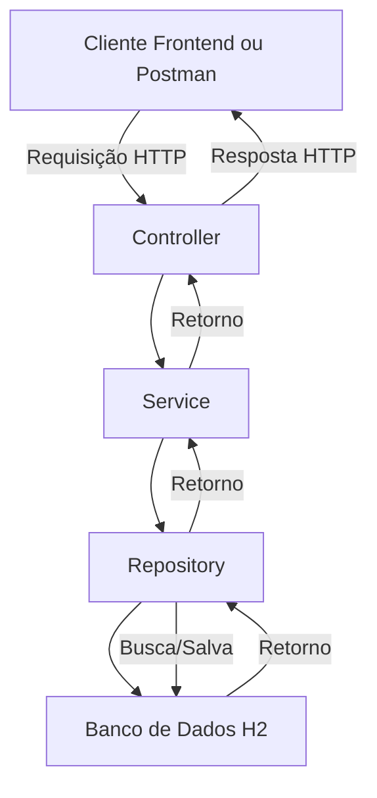

---

# 📚 API de Cursos

Uma API fictícia para gestão de cursos de programação, desenvolvida em Java utilizando Spring Boot.

---

## 🚀 Funcionalidades

- Criar um novo curso
- Listar todos os cursos
- Atualizar um curso pelo `id`
- Remover um curso pelo `id`
- Alterar o status ativo/inativo de um curso

---

## 🏗️ Tecnologias utilizadas

- Java 17
- Spring Boot
- Spring Data JPA
- Banco de Dados H2
- Hibernate
- Lombok
- Bean Validation (Jakarta Validation)

---

## 🔥 Rotas da API

| Método | Endpoint            | Descrição                         |
|--------|---------------------|-----------------------------------|
| POST   | `/cursos`            | Criar um novo curso               |
| GET    | `/cursos`            | Listar todos os cursos            |
| PUT    | `/cursos/{id}`        | Atualizar um curso existente      |
| DELETE | `/cursos/{id}`        | Remover um curso                  |
| PATCH  | `/cursos/{id}/active` | Alternar status ativo/inativo     |

---

## 🛠️ Modelo do Curso

```json
{
  "id": "UUID",
  "name": "Nome do Curso",
  "category": "Categoria do Curso",
  "active": true,
  "createdAt": "2024-04-28T12:00:00",
  "updatedAt": "2024-04-28T12:00:00"
}
```

---

## 🛤️ Fluxo de funcionamento da aplicação



---

## ⚡ Como rodar o projeto localmente

1. Clone o repositório:
```bash
git clone https://github.com/seu-usuario/seu-repositorio.git
```

2. Entre no diretório do projeto:
```bash
cd seu-repositorio
```

3. Instale as dependências (se necessário) e rode o projeto:
```bash
./mvnw spring-boot:run
```

4. Acesse o H2 Console (opcional):
```
http://localhost:8080/h2-console
```
- JDBC URL: `jdbc:h2:mem:cursosdb`
- User: `sa`
- Password: *(deixe em branco)*

---

## ✅ Melhorias futuras

- Implementação de DTOs para Request e Response
- Tratamento global de exceções (`@ControllerAdvice`)
- Paginação na listagem dos cursos
- Testes unitários e de integração

---

# 🚀 Autor

Desenvolvido com 💻 por Gustavo Alves.

---

